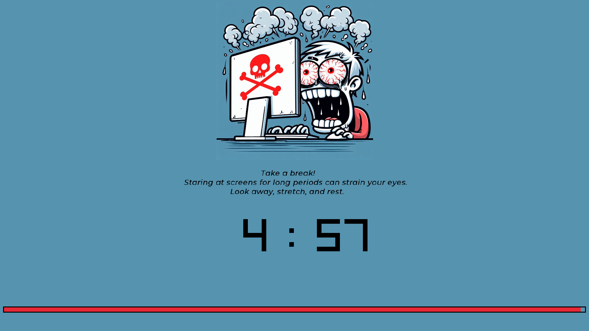

# keep-your-eye-health

## important details
The app will close your screen every 25 minuts (the app does not run close your screen infrist time ) 
You can escape this close if its by pressing `Esc` key  
You can stop the entire program by pressing `Ctrl + x` when the close window is running 
You can take a screenshot to the close window by pressing `S` key 

**Have fun**

# Version 1.0.0
You can download the windows verions from **[here](out/keep_your_eye_health_Windows.zip)**
 
The linux version will publish soon 

